# Лабораторна робота 4 — MongoDB

Виконав Онофрей Ростислав КМ-32

## Колекція `items`

### 1) Створення товарів

```javascript
db.items.insertMany([...]);
```

Результат: додано 11 товарів.

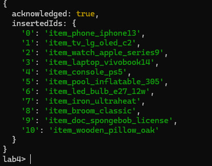

### 2) Вивід усіх товарів

```javascript
db.items.find();
```

Результат: виведено всі товари з різними властивостями.

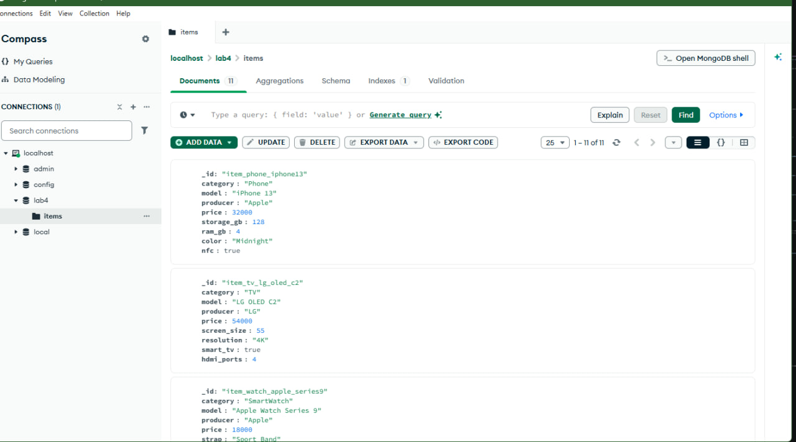
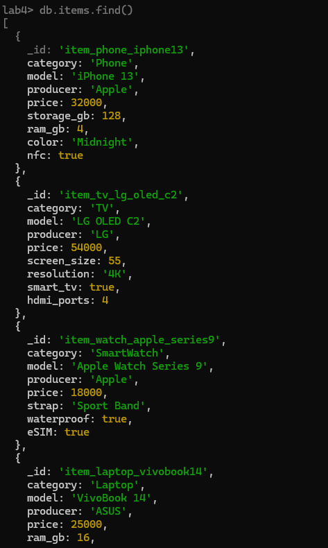

### 3) Кількість товарів у категорії

```javascript
print("Кількість товарів у категорії Phone: " + db.items.countDocuments({ category: "Phone" }));
```

Результат: `Кількість товарів у категорії Phone: 1`.

### 4) Кількість категорій

```javascript
print("Кількість категорій: " + db.items.distinct("category").length);
```

Результат: `Кількість категорій: 11`.

### 5) Виробники товарів без повторів

```javascript
db.items.distinct("producer");
```

Результат: отримано список унікальних виробників.

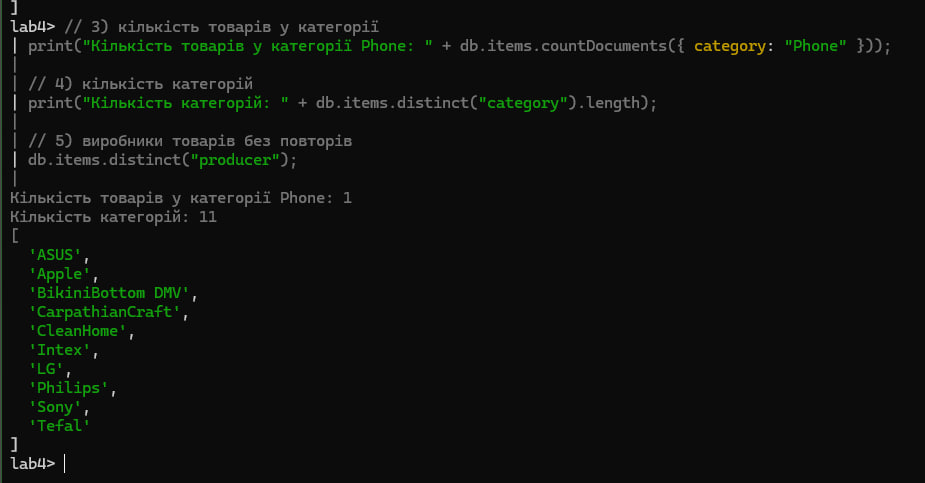

### 6a) Товари за категорією та ціною (`$and`)

```javascript
db.items.find({
  $and: [{ category: "Phone" }, { price: { $gte: 30000, $lte: 37000 } }],
});
```

Результат: знайдено товар(и) категорії `Phone` у вказаному діапазоні.

### 6b) Модель одна чи інша (`$or`)

```javascript
db.items.find({
  $or: [{ model: "iPhone 13" }, { model: "LG OLED C2" }],
});
```

Результат: знайдено товари з моделями `iPhone 13` або `LG OLED C2`.

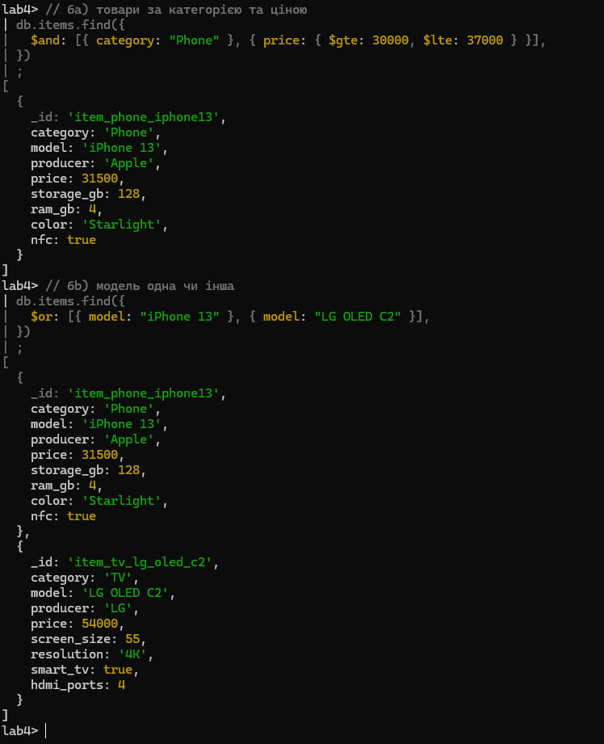

### 6c) Виробники з переліку (`$in`)

```javascript
db.items.find({
  producer: { $in: ["Apple", "Sony"] },
});
```

Результат: знайдено товари виробників `Apple` та `Sony`.

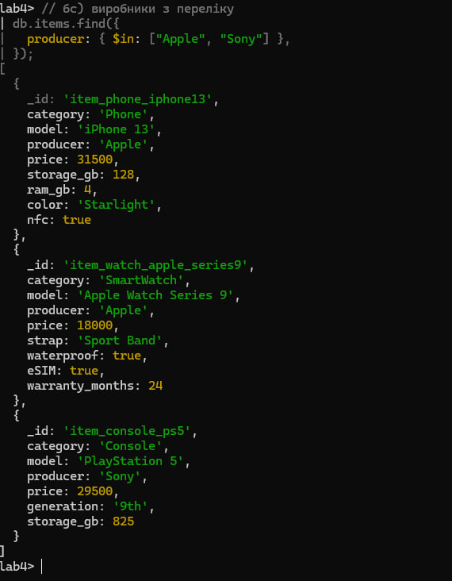

### 7) Оновлення товарів

```javascript
db.items.updateOne(
  { model: "iPhone 13" },
  { $set: { price: 31500, color: "Starlight" } }
);

db.items.updateMany(
  { category: "SmartWatch" },
  { $set: { warranty_months: 24 } }
);
```

Результат: оновлено документи за заданими критеріями.

### 8) Товари, у яких присутнє поле `nfc`

```javascript
db.items.find(
  { nfc: { $exists: true } },
  { _id: 0, model: 1, price: 1 }
);
```

Результат: знайдено товари з полем `nfc`.

### 9) Збільшення вартості знайдених товарів

```javascript
db.items.updateMany({ nfc: { $exists: true } }, { $inc: { price: 500 } });
db.items.find(
  { nfc: { $exists: true } },
  { _id: 0, model: 1, price: 1 }
);
```

Результат: ціна знайдених товарів збільшена на 500, перевірка виконана.

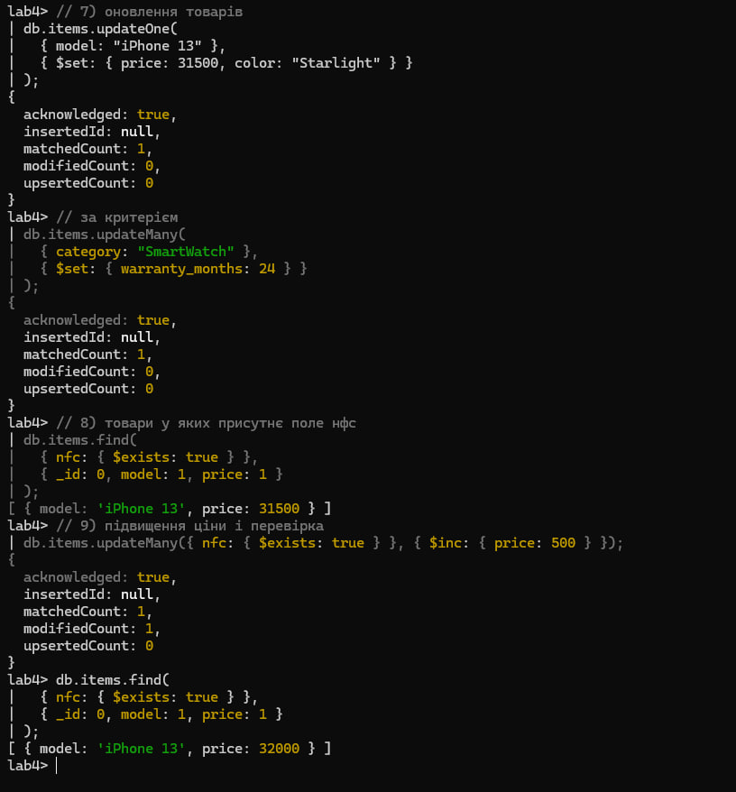

---

## Колекція `orders`

### 1) Створення замовлень

```javascript
db.orders.insertMany([...]);
```

Результат: додано 4 замовлення.

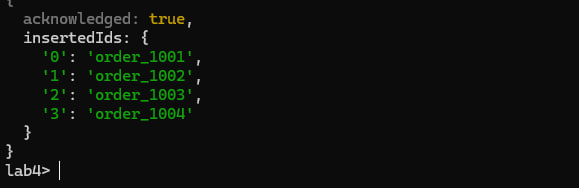

### 2) Вивід усіх замовлень

```javascript
db.orders.find();
```

Результат: виведено всі замовлення.

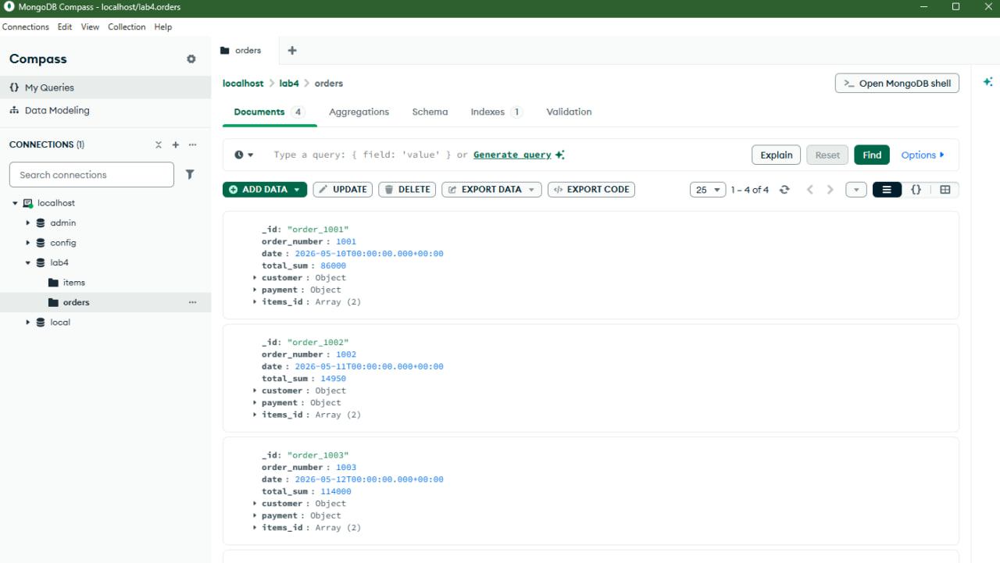
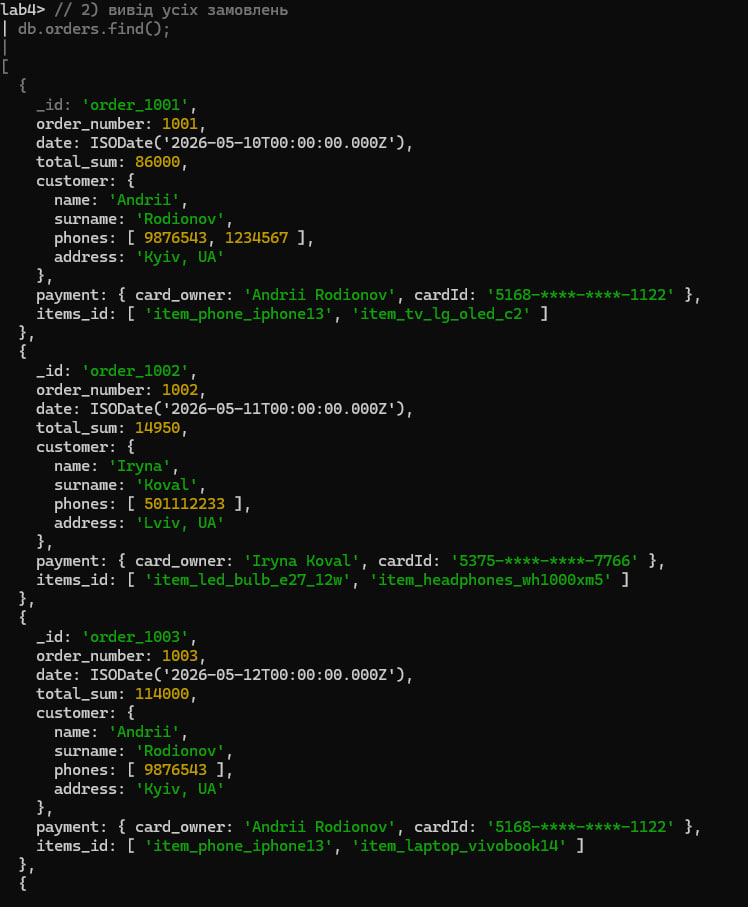

### 3) Замовлення з вартістю більше 50000

```javascript
db.orders.find({ total_sum: { $gt: 50000 } });
```

Результат: знайдено замовлення з `total_sum > 50000`.

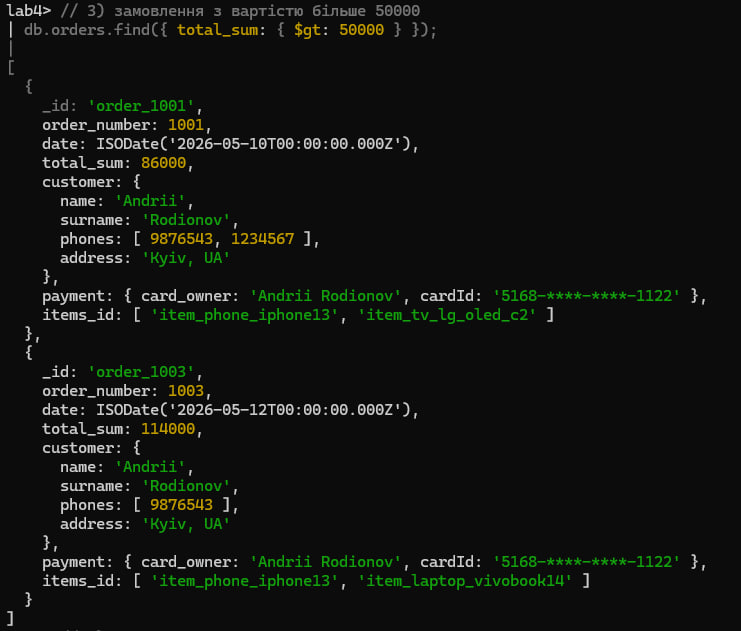

### 4) Замовлення одного замовника

```javascript
db.orders.find({
  "customer.name": "Andrii",
  "customer.surname": "Rodionov",
});
```

Результат: знайдено замовлення клієнта `Andrii Rodionov`.

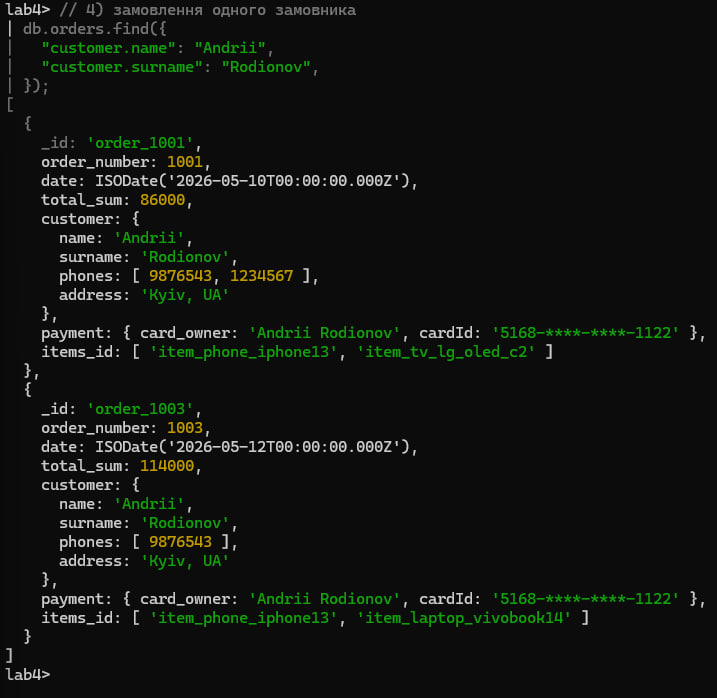

### 5) Замовлення з певним товаром

```javascript
db.orders.find({ items_id: "item_phone_iphone13" });
```

Результат: знайдено замовлення, що містять товар `item_phone_iphone13`.

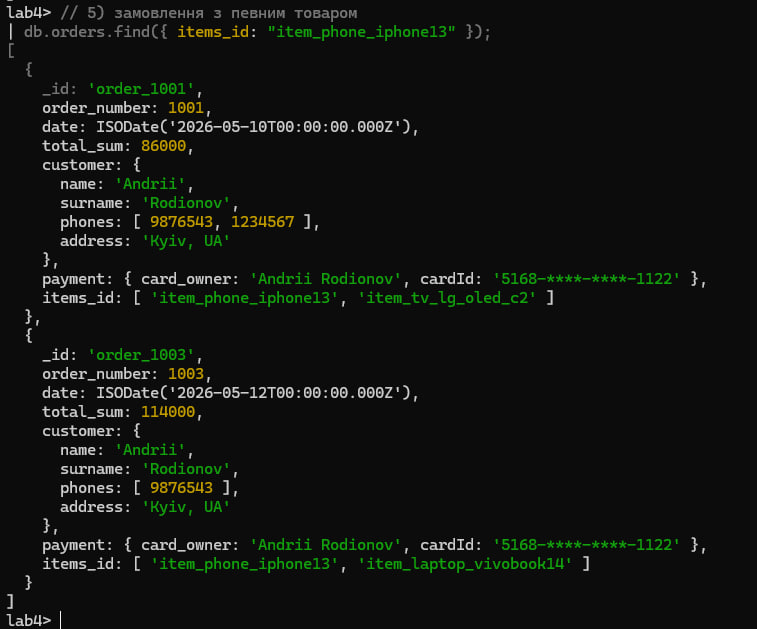

### 6) Додати товар у замовлення і збільшити суму

```javascript
db.orders.updateMany(
  { items_id: "item_phone_iphone13" },
  { $addToSet: { items_id: "item_iron_ultraheat" }, $inc: { total_sum: 2300 } }
);
```

Результат: оновлено 2 замовлення.

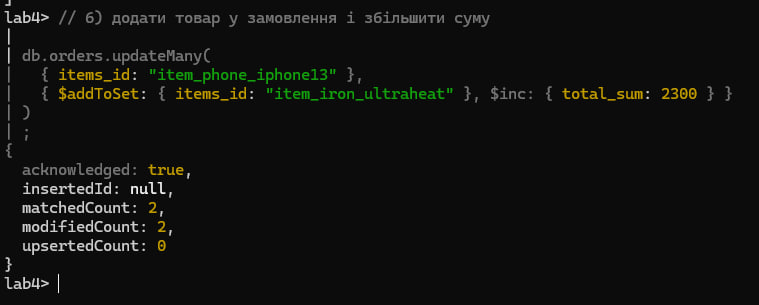

### 7) Кількість товарів у певному замовленні

```javascript
const order1001 = db.orders.findOne(
  { order_number: 1001 },
  { _id: 0, items_id: 1 }
);
print("Кількість товарів у замовленні 1001: " + (order1001 ? order1001.items_id.length : 0));
```

Результат: `Кількість товарів у замовленні 1001: 3`.

### 8) Інформація про кастомера і номер картки для дорогих замовлень

```javascript
db.orders.find(
  { total_sum: { $gt: 70000 } },
  { _id: 0, customer: 1, "payment.cardId": 1 }
);
```

Результат: виведено лише `customer` та `payment.cardId`.

### 9) Видалити товар із замовлень за період

```javascript
db.orders.updateMany(
  {
    date: {
      $gte: ISODate("2026-05-11T00:00:00Z"),
      $lte: ISODate("2026-05-13T23:59:59Z"),
    },
  },
  { $pull: { items_id: "item_headphones_wh1000xm5" } }
);
```

Результат: знайдено 2 замовлення, змінено 1.

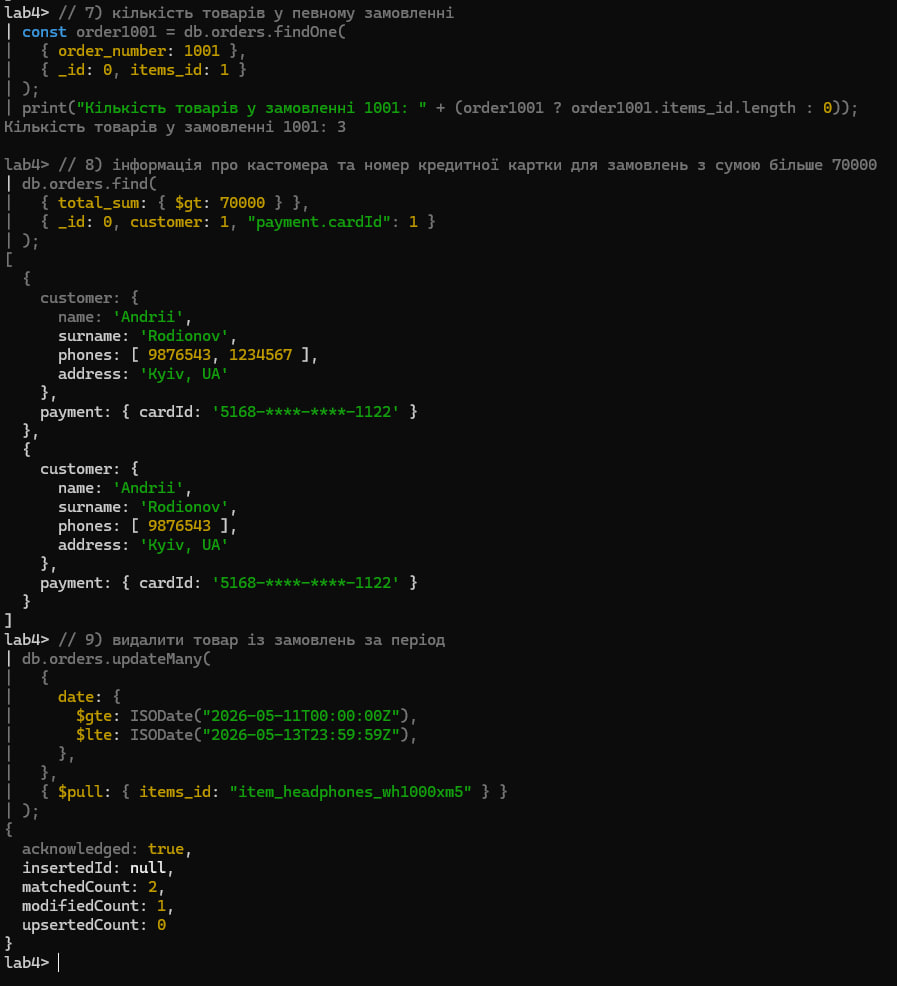

### 10) Змінити прізвище у всіх замовленнях

```javascript
db.orders.updateMany({}, { $set: { "customer.surname": "Shevchenko" } });
```

Результат: змінено 4 документи.

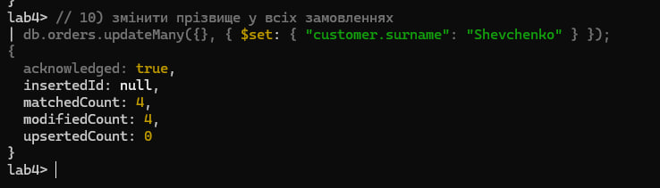

### 11) Замовлення одного замовника + підстановка товарів (`$lookup`)

```javascript
db.orders.aggregate([
  {
    $match: {
      "customer.name": "Andrii",
      "customer.surname": "Shevchenko",
    },
  },
  {
    $lookup: {
      from: "items",
      localField: "items_id",
      foreignField: "_id",
      as: "items_info",
    },
  },
  {
    $project: {
      _id: 0,
      customer: 1,
      items: {
        $map: {
          input: "$items_info",
          as: "i",
          in: { model: "$$i.model", price: "$$i.price" },
        },
      },
    },
  },
]);
```

Результат: для замовлень клієнта виведено customer + список товарів (модель і ціна).

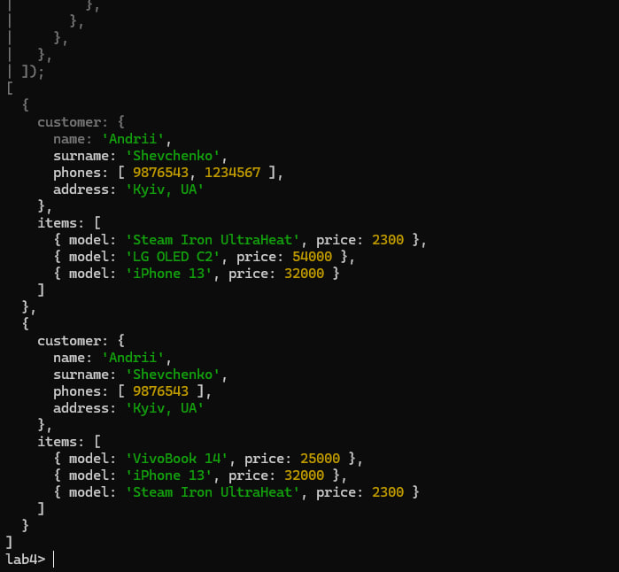

---

## Capped collection `reviews_capped`

### 1) Створення capped collection

```javascript
db.createCollection("reviews_capped", {
  capped: true,
  size: 16384,
  max: 5,
});
```

### 2) Додавання 7 відгуків

```javascript
db.reviews_capped.insertMany([...]);
```

### 3) Перевірка, що залишились 5 останніх

```javascript
db.reviews_capped
  .find({}, { _id: 0, review_id: 1, author: 1 })
  .sort({ review_id: 1 });
```

Результат: у колекції залишились `review_id` 3..7.

### 4) Кількість відгуків у capped collection

```javascript
print("Кількість відгуків у capped колекції: " + db.reviews_capped.countDocuments());
```

Результат: `Кількість відгуків у capped колекції: 5`.

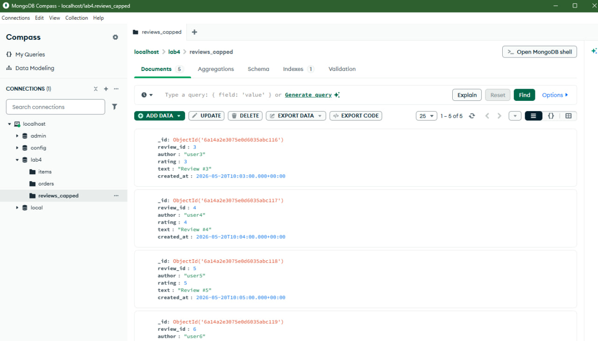
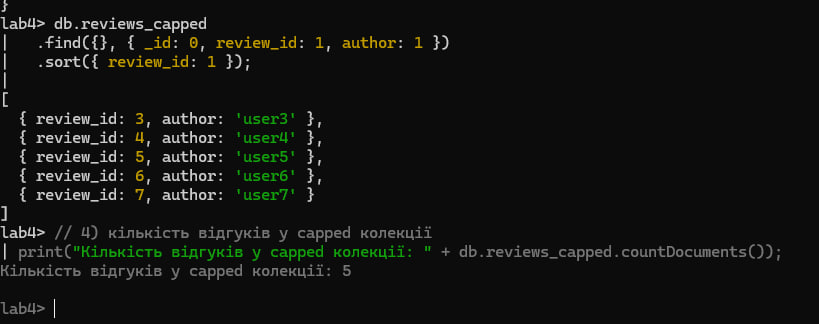
