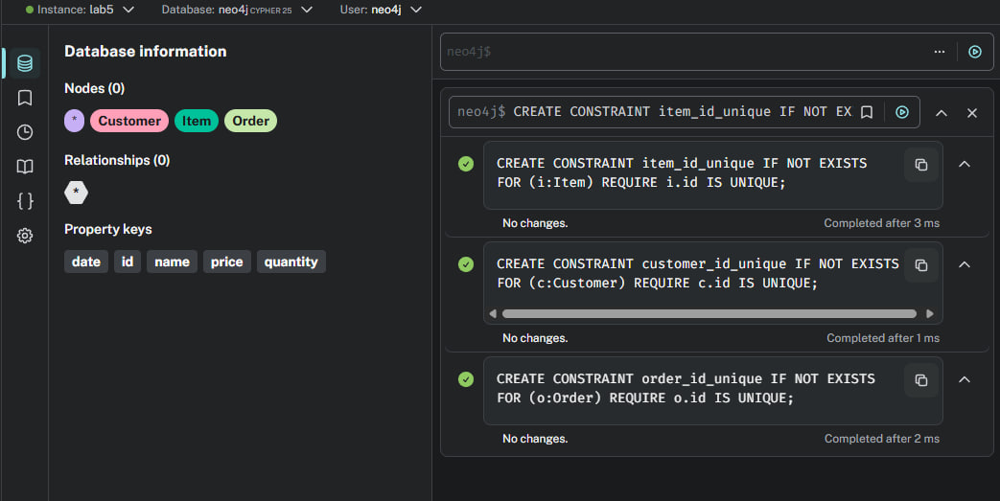
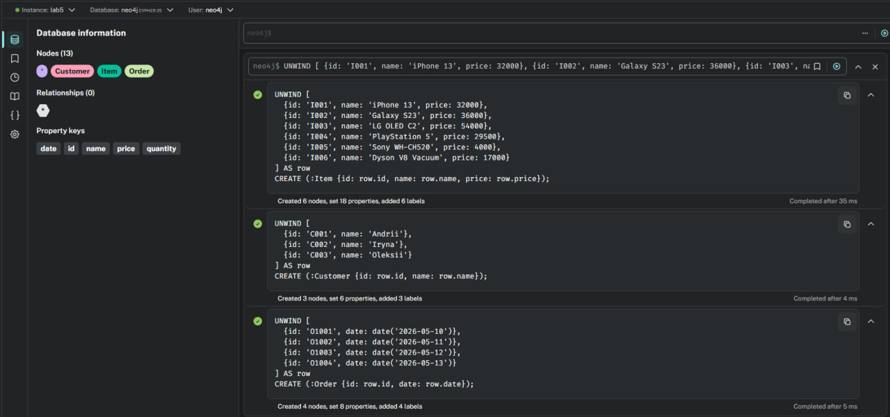
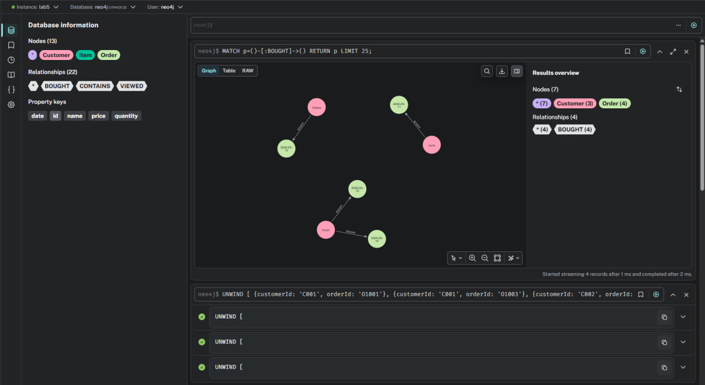
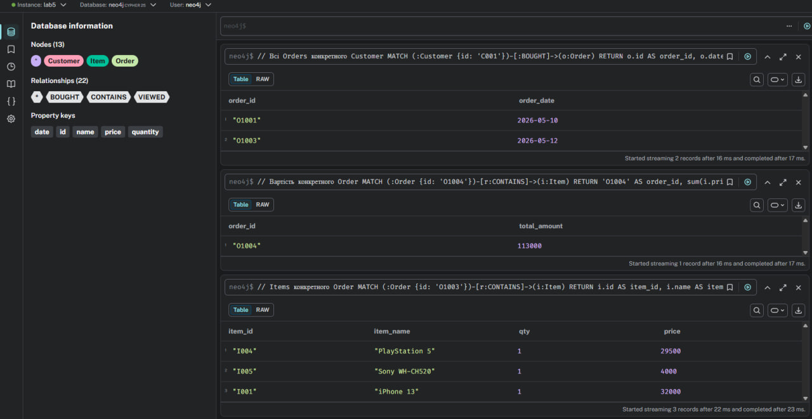
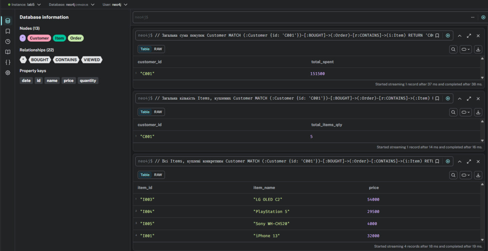
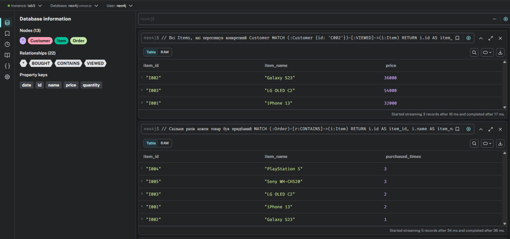
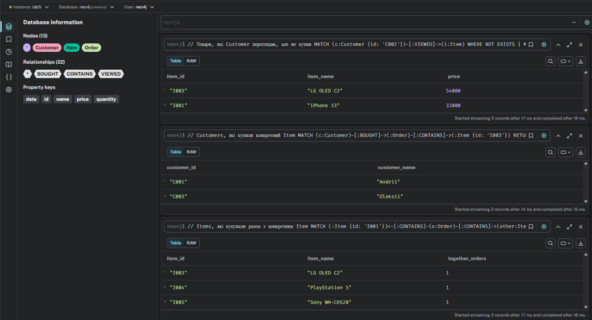

# Лабораторна робота 5 - Neo4j 

Виконав Онофрей Ростислав КМ-32

## 0) Підготовка БД

### Очищення та створення обмежень

```cypher
MATCH (n) DETACH DELETE n;

CREATE CONSTRAINT item_id_unique IF NOT EXISTS
FOR (i:Item) REQUIRE i.id IS UNIQUE;

CREATE CONSTRAINT customer_id_unique IF NOT EXISTS
FOR (c:Customer) REQUIRE c.id IS UNIQUE;

CREATE CONSTRAINT order_id_unique IF NOT EXISTS
FOR (o:Order) REQUIRE o.id IS UNIQUE;
```



### Створення вузлів Item, Customer, Order

```cypher
UNWIND [
  {id: 'I001', name: 'iPhone 13', price: 32000},
  {id: 'I002', name: 'Galaxy S23', price: 36000},
  {id: 'I003', name: 'LG OLED C2', price: 54000},
  {id: 'I004', name: 'PlayStation 5', price: 29500},
  {id: 'I005', name: 'Sony WH-CH520', price: 4000},
  {id: 'I006', name: 'Dyson V8 Vacuum', price: 17000}
] AS row
CREATE (:Item {id: row.id, name: row.name, price: row.price});

UNWIND [
  {id: 'C001', name: 'Andrii'},
  {id: 'C002', name: 'Iryna'},
  {id: 'C003', name: 'Oleksii'}
] AS row
CREATE (:Customer {id: row.id, name: row.name});

UNWIND [
  {id: '01001', date: date('2026-05-10')},
  {id: '01002', date: date('2026-05-11')},
  {id: '01003', date: date('2026-05-12')},
  {id: '01004', date: date('2026-05-13')}
] AS row
CREATE (:Order {id: row.id, date: row.date});
```



### Створення звʼязків BOUGHT, CONTAINS, VIEWED

```cypher
UNWIND [
  {customerId: 'C001', orderId: '01001'},
  {customerId: 'C001', orderId: '01003'},
  {customerId: 'C002', orderId: '01002'},
  {customerId: 'C003', orderId: '01004'}
] AS row
MATCH (c:Customer {id: row.customerId})
MATCH (o:Order {id: row.orderId})
MERGE (c)-[:BOUGHT]->(o);

UNWIND [
  {orderId: '01001', itemId: 'I001', quantity: 1},
  {orderId: '01001', itemId: 'I003', quantity: 1},
  {orderId: '01002', itemId: 'I002', quantity: 1},
  {orderId: '01002', itemId: 'I005', quantity: 2},
  {orderId: '01003', itemId: 'I001', quantity: 1},
  {orderId: '01003', itemId: 'I004', quantity: 1},
  {orderId: '01003', itemId: 'I005', quantity: 1},
  {orderId: '01004', itemId: 'I003', quantity: 1},
  {orderId: '01004', itemId: 'I004', quantity: 2}
] AS row
MATCH (o:Order {id: row.orderId})
MATCH (i:Item {id: row.itemId})
MERGE (o)-[r:CONTAINS]->(i)
SET r.quantity = row.quantity;

UNWIND [
  {customerId: 'C001', itemId: 'I002'},
  {customerId: 'C001', itemId: 'I005'},
  {customerId: 'C001', itemId: 'I006'},
  {customerId: 'C002', itemId: 'I001'},
  {customerId: 'C002', itemId: 'I002'},
  {customerId: 'C002', itemId: 'I003'},
  {customerId: 'C003', itemId: 'I003'},
  {customerId: 'C003', itemId: 'I004'},
  {customerId: 'C003', itemId: 'I006'}
] AS row
MATCH (c:Customer {id: row.customerId})
MATCH (i:Item {id: row.itemId})
MERGE (c)-[:VIEWED]->(i);
```



---

## Запити

### Items конкретного Order

```cypher
MATCH (:Order {id: '01003'})-[r:CONTAINS]->(i:Item)
RETURN i.id AS item_id, i.name AS item_name, r.quantity AS qty, i.price AS price
ORDER BY i.name;
```

### Вартість конкретного Order

```cypher
MATCH (:Order {id: '01004'})-[r:CONTAINS]->(i:Item)
RETURN '01004' AS order_id, sum(i.price * coalesce(r.quantity, 1)) AS total_amount;
```

### Всі Orders конкретного Customer

```cypher
MATCH (:Customer {id: 'C001'})-[:BOUGHT]->(o:Order)
RETURN o.id AS order_id, o.date AS order_date
ORDER BY o.date;
```



---

### Всі Items, куплені конкретним Customer

```cypher
MATCH (:Customer {id: 'C001'})-[:BOUGHT]->(:Order)-[:CONTAINS]->(i:Item)
RETURN DISTINCT i.id AS item_id, i.name AS item_name, i.price AS price
ORDER BY i.name;
```

### Загальна кількість Items, куплених Customer

```cypher
MATCH (:Customer {id: 'C001'})-[:BOUGHT]->(:Order)-[r:CONTAINS]->(:Item)
RETURN 'C001' AS customer_id, sum(coalesce(r.quantity, 1)) AS total_items_qty;
```

### Загальна сума покупок Customer

```cypher
MATCH (:Customer {id: 'C001'})-[:BOUGHT]->(:Order)-[r:CONTAINS]->(i:Item)
RETURN 'C001' AS customer_id, sum(i.price * coalesce(r.quantity, 1)) AS total_spent;
```



---

### Скільки разів кожен товар був придбаний

```cypher
MATCH (:Order)-[r:CONTAINS]->(i:Item)
RETURN i.id AS item_id, i.name AS item_name, sum(coalesce(r.quantity, 1)) AS purchased_times
ORDER BY purchased_times DESC, item_name ASC;
```

### Всі Items, які переглянув конкретний Customer

```cypher
MATCH (:Customer {id: 'C002'})-[:VIEWED]->(i:Item)
RETURN i.id AS item_id, i.name AS item_name, i.price AS price
ORDER BY i.name;
```



### Items, які купували разом з конкретним Item

```cypher
MATCH (:Item {id: 'I001'})<-[:CONTAINS]-(o:Order)-[:CONTAINS]->(other:Item)
WHERE other.id <> 'I001'
RETURN other.id AS item_id, other.name AS item_name, count(DISTINCT o) AS together_orders
ORDER BY together_orders DESC, item_name ASC;
```



---

### Customers, які купили конкретний Item

```cypher
MATCH (c:Customer)-[:BOUGHT]->(:Order)-[:CONTAINS]->(:Item {id: 'I003'})
RETURN DISTINCT c.id AS customer_id, c.name AS customer_name
ORDER BY customer_name;
```

### Товари, які Customer переглядав, але не купив

```cypher
MATCH (c:Customer {id: 'C002'})-[:VIEWED]->(i:Item)
WHERE NOT EXISTS {
  MATCH (c)-[:BOUGHT]->(:Order)-[:CONTAINS]->(i)
}
RETURN i.id AS item_id, i.name AS item_name, i.price AS price
ORDER BY i.name;
```


